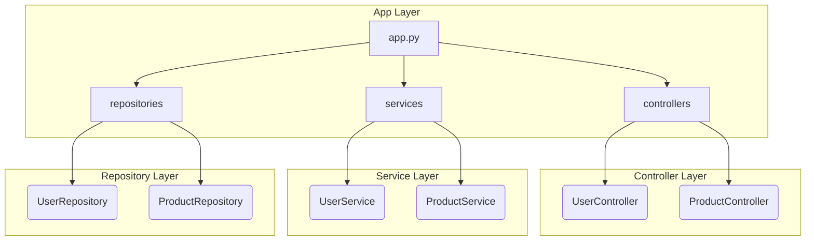

# 📝 Project Documentation

**Gemma2:2b Model Integration with Ollama and Langchain**
===========================================================

**Overview**
------------

This codebase integrates the Gemma2:2b model with Ollama and Langchain, enabling the utilization of the model's capabilities within a conversational AI framework. The integration allows for seamless interaction with the model, facilitating tasks such as text generation, question answering, and more.

**Usage**
---------

To utilize the Gemma2:2b model with Ollama and Langchain, follow these steps:

1. Clone the repository and navigate to the `cloned_repo` directory.
2. Ensure that the necessary dependencies are installed, including Ollama and Langchain.
3. Run the `app.py` script to initiate the integration.

**Architecture Summary**
------------------------

The architecture of this codebase consists of the following components:

* **Gemma2:2b Model**: The Gemma2:2b model is a pre-trained language model used for various NLP tasks.
* **Ollama**: Ollama is a conversational AI framework that enables interaction with the Gemma2:2b model.
* **Langchain**: Langchain is a library used for integrating the Gemma2:2b model with Ollama.

**Technical Details**
---------------------

### Dependencies

* Ollama
* Langchain

### Code Structure

The codebase consists of a single Python script, `app.py`, which integrates the Gemma2:2b model with Ollama and Langchain.

### Integration Process

The integration process involves the following steps:

1. Initialization: The `app.py` script initializes the Ollama and Langchain libraries.
2. Model Loading: The Gemma2:2b model is loaded using the Langchain library.
3. Model Integration: The Gemma2:2b model is integrated with Ollama, enabling interaction with the model.

### Example Usage

```python
from app import main

# Initialize the Ollama and Langchain libraries
main()
```

### Commit History

The commit history for this codebase is as follows:

* 2025-02-25: Diwakar Tiwari - Gemma2:2b model on Ollama
* 2025-02-25: Diwakar Tiwari - Langchain setup, Langchain integration with Ollama

**Troubleshooting**
-------------------

In case of any issues or errors, refer to the following troubleshooting steps:

* Ensure that the necessary dependencies are installed.
* Verify that the Gemma2:2b model is loaded correctly.
* Check the Ollama and Langchain libraries for any errors or issues.

**Future Development**
----------------------

Future development plans for this codebase include:

* Enhancing the integration process to support multiple models.
* Improving the performance and efficiency of the Gemma2:2b model.
* Expanding the capabilities of the Ollama and Langchain libraries.

---

## 🔍 Architecture Diagram (Mermaid)


